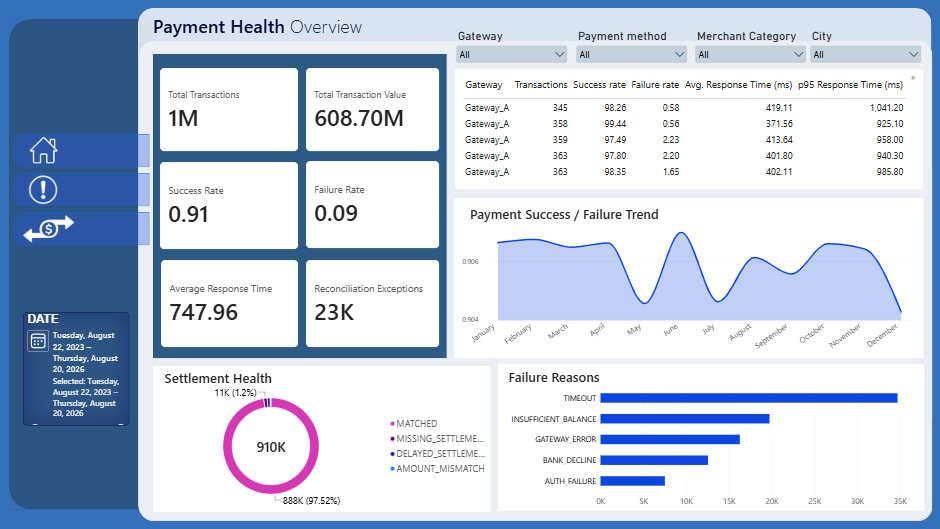
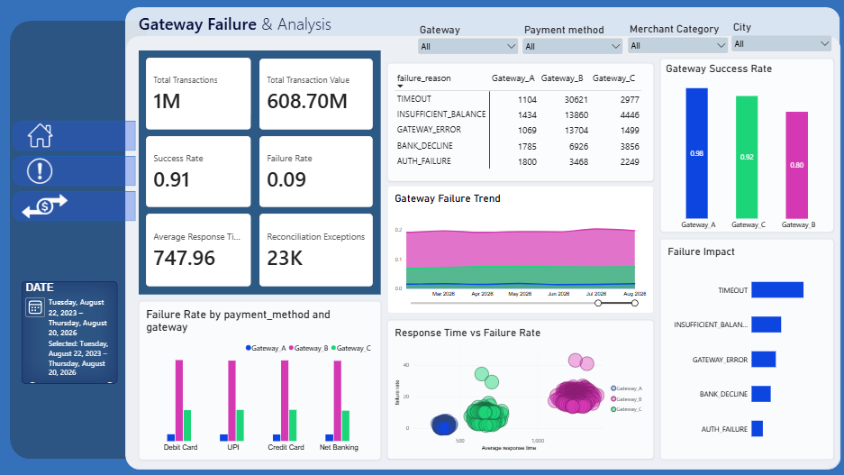
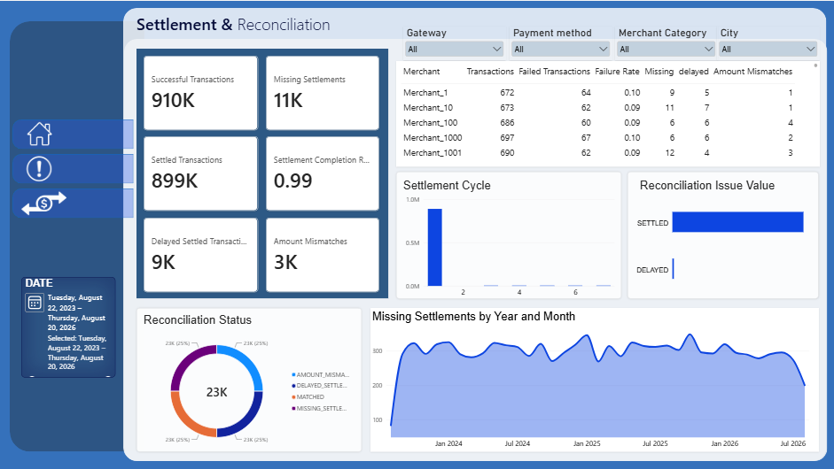
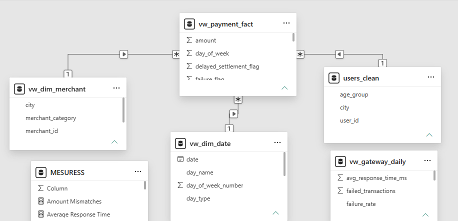

# 💳 Payment Operations & Reconciliation Analytics


> End-to-end payment analytics project using **BigQuery, SQL, Python, and Power BI** to identify payment failure drivers, gateway performance issues, and settlement reconciliation risks.

---

## 🎯 Business Objective

> **Identify the major drivers of payment failures, evaluate payment gateway performance, quantify financial exposure, and uncover settlement/reconciliation issues to support operational decision-making.**

---

## ❗ Problem Statement

The payment platform processes a large volume of transactions across multiple gateways and payment methods. The business needs to understand:

- Which gateway is underperforming?
- What are the major failure reasons?
- Where is the largest financial exposure?
- Are failures related to payment method or gateway performance?
- Are successful payments being settled correctly and on time?
- What actions should Payments and Finance teams prioritize?

---

## 🛠️ Solution

Built an end-to-end analytics workflow:

```text
Raw Data
   ↓
BigQuery
   ↓
Data Cleaning & Validation
   ↓
Clean Tables
   ↓
SQL Analysis & Reporting Views
   ↓
Power BI
   ↓
Business Insights & Recommendations
```

-----

## 🛠️ Solution

The analysis covers:

- Gateway performance
- Payment failures
- Failure reasons
- Response-time behavior
- Payment methods
- Settlement completion
- Reconciliation exceptions

---

## 📊 Key Insights

### 🔴 Gateway B is the Primary Performance Risk

- **19.50% failure rate** vs **1.59% for Gateway A**
- **68,579 failed transactions**
- **₹41.26M failed transaction value**
- **1,247 ms average response time**
- **2,731 ms P95 response time**

### 🔴 TIMEOUT is Gateway B's Dominant Failure Reason

- **30,621 timeout failures**
- **44.65% of Gateway B failures**
- **₹18.39M timeout-related failed transaction value**

### 🟡 Gateway is a Stronger Differentiator Than Payment Method

Payment methods show almost identical overall performance:

- ~**90.6% success rate**
- ~**9% failure rate**
- ~**746–749 ms average response time**

Gateway-level performance differences are substantially larger.

### 🟡 Latency Does Not Independently Explain Failures

Overall failure rate increases from **4.69% (<500 ms)** to **17.92% (>1500 ms)**.

However, failure rates remain relatively stable across latency buckets **within each gateway**.

> Therefore, the analysis does not establish that higher latency directly causes payment failures. **Gateway-level reliability is the stronger differentiator in this dataset.**

### 🟢 Settlement Performance is Generally Strong

- **910,069 successful transactions**
- **899,185 settled transactions**
- **98.8% settlement completion**
- **99% of settlements complete within 1 day**

However:

- Missing settlement value: **₹6.59M**
- Delayed settlement value: **₹5.44M**
- Amount mismatch value: **₹1.56M**
- Total reconciliation exception value: **₹13.59M**

---

## 💡 Business Recommendations

### 1. Prioritize Gateway B

Investigate Gateway B's reliability, processing capacity, integration behavior, timeout configuration, and routing/retry mechanisms.

Use **Gateway A as the internal performance benchmark**.

### 2. Prioritize Gateway B Timeout Failures

TIMEOUT represents **44.65% of Gateway B failures** and approximately **₹18.39M** in failed transaction value.

Investigate timeout behavior before increasing transaction volume through Gateway B.

### 3. Strengthen Settlement Exception Monitoring

Automate monitoring and escalation for:

- Missing settlements
- Delayed settlements
- Amount mismatches

Use the **1-day settlement cycle as the operational benchmark**.

---

## 📈 Power BI Dashboard

### Overview



### Failures



### Settlements



---

## 🗂️ Data Model



---

## 📦 Dataset

| Entity | Records |
|---|---:|
| Users | 60,000 |
| Merchants | 1,500 |
| Transactions | 1,004,848 |
| Settlements | 962,702 |

**Dataset:** [View / Generate Dummy Data](Dummy_Data.py)

---

## 🔧 Tech Stack

**Data & Analysis:** Python, Pandas, NumPy, SQL

**Data Warehouse:** Google BigQuery

**BI & Visualization:** Power BI

**Version Control:** Git, GitHub

---

## 📁 Project Resources

- [SQL Analysis](SQL-part-on-Bigquery/Data Analysis.sql)
- [Dataset](YOUR_DATASET_LINK)
- [Power BI Dashboard](YOUR_POWER_BI_LINK)
- [Data Generator](YOUR_DATA_GENERATOR_LINK)

---

## 🎯 Final Outcome

> **The analysis identified Gateway B as the primary payment-performance risk, with a 19.50% failure rate and ₹41.26M in failed transaction value. Timeout failures alone accounted for 44.65% of Gateway B failures and ₹18.39M in failed value. The recommended actions are to prioritize Gateway B remediation, use Gateway A as the performance benchmark, and strengthen automated monitoring of the ₹13.59M in settlement reconciliation exceptions.**

---

### 👩‍💻 Author

**T Shalini Patra**

[LinkedIn](https://www.linkedin.com/in/patrashalini/) · [GitHub](https://github.com/Shalini-patra)
